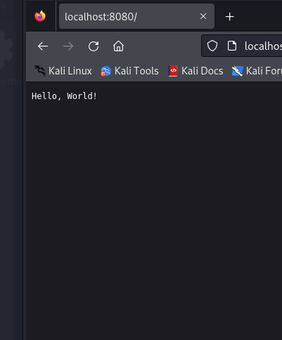

# Task 1: Process Management Simulator

## Overview

In this task, I've implemented a process management simulator that mimics the behavior of operating system processes. The simulator supports key system calls such as `fork` and `exec`, allowing for the creation of child processes, duplication of the parent process's address space, and the ability for the child to replace its memory image with a new program using `exec`. The simulator also manages process states (ready, running, blocked), handles process termination, and maintains process hierarchies.

## Key Features

1. **Process Creation and Forking**: The simulator allows the creation of child processes using the `fork` system call. The child process inherits the address space of the parent process.
2. **Exec System Call**: The `exec` system call replaces the current process's memory image with a new program.
3. **Process States**: Processes can be in one of three states: `READY`, `RUNNING`, or `BLOCKED`.
4. **Process Termination**: The simulator supports terminating processes and cleaning up resources.
5. **Process Hierarchies**: The simulator maintains parent-child relationships between processes.

## Files and Their Roles

### 1. `process_simulator.cpp`

This file contains the implementation of the process management simulator. It defines the `Process` and `ProcessManager` classes, which handle process creation, execution, and termination.

#### Code Snippet:
```cpp
#include <iostream>
#include <vector>
#include <unordered_map>
#include <memory>
#include <string>

enum class ProcessState { READY, RUNNING, BLOCKED };

class Process {
private:
    int pid;
    int ppid;
    ProcessState state;
    std::vector<uint8_t> addressSpace;
    std::vector<std::shared_ptr<Process>> children;

public:
    Process(int pid, int ppid = 0) : 
        pid(pid), ppid(ppid), state(ProcessState::READY) {
        addressSpace.resize(1024, 0); // Simple 1KB address space
    }

    int getPid() const { return pid; }
    int getPPid() const { return ppid; }
    ProcessState getState() const { return state; }
    void setState(ProcessState newState) { state = newState; }
    
    std::shared_ptr<Process> fork() {
        auto child = std::make_shared<Process>(getNextPid(), pid);
        child->addressSpace = addressSpace; // Copy address space
        children.push_back(child);
        return child;
    }

    bool exec(const std::string& program) {
        // Simulate loading new program
        addressSpace.clear();
        addressSpace.resize(1024, 0);
        // Simulate program loading
        std::cout << "Executing program: " << program << " in process " << pid << std::endl;
        return true;
    }

private:
    static int getNextPid() {
        static int nextPid = 1;
        return nextPid++;
    }
};

class ProcessManager {
private:
    std::unordered_map<int, std::shared_ptr<Process>> processes;
    std::shared_ptr<Process> currentProcess;

public:
    ProcessManager() {
        // Create init process
        auto init = std::make_shared<Process>(0);
        processes[0] = init;
        currentProcess = init;
    }

    std::shared_ptr<Process> fork() {
        if (!currentProcess) return nullptr;
        auto child = currentProcess->fork();
        processes[child->getPid()] = child;
        return child;
    }

    bool exec(const std::string& program) {
        if (!currentProcess) return false;
        return currentProcess->exec(program);
    }

    bool terminateProcess(int pid) {
        if (processes.find(pid) == processes.end()) return false;
        processes.erase(pid);
        return true;
    }

    void switchProcess(int pid) {
        if (processes.find(pid) != processes.end()) {
            if (currentProcess) 
                currentProcess->setState(ProcessState::READY);
            currentProcess = processes[pid];
            currentProcess->setState(ProcessState::RUNNING);
        }
    }
};

// Example usage
int main() {
    ProcessManager pm;
    
    // Create child process
    auto child = pm.fork();
    std::cout << "Created child process: " << child->getPid() << std::endl;
    
    // Execute new program in child
    pm.switchProcess(child->getPid());
    pm.exec("new_program.exe");
    
    // Terminate child
    pm.terminateProcess(child->getPid());
    
    return 0;
}
```

#### How to Run:
1. Compile the file using a C++ compiler (e.g., `g++`):
   ```bash
   g++ process_simulator.cpp -o process_simulator
   ```
2. Run the compiled program:
   ```bash
   ./process_simulator
   ```
3. The program will simulate the creation of a child process, execution of a new program, and termination of the child process.


---

### 2. `virtual_memory.cpp`

This file implements a simple virtual memory system with paging. It simulates a process with virtual memory addresses that are mapped to physical memory using a page table. The system handles page faults and implements the LRU (Least Recently Used) page replacement algorithm.

#### Code Snippet:
```cpp
// Virtual Memory System with Paging
#include <iostream>
#include <vector>
#include <unordered_map>
#include <list>
#include <cstdint>

const size_t PAGE_SIZE = 4096;
const size_t NUM_PAGES = 256;
const size_t NUM_FRAMES = 128;

struct Page {
    uint8_t data[PAGE_SIZE];
    bool dirty = false;
    bool present = false;
};

struct PageTableEntry {
    uint32_t frame_number;
    bool present;
    bool dirty;
};

class VirtualMemory {
private:
    std::vector<Page> physical_memory;
    std::vector<PageTableEntry> page_table;
    std::list<uint32_t> lru_list;
    std::unordered_map<uint32_t, std::list<uint32_t>::iterator> page_to_lru;
    size_t free_frames;

public:
    VirtualMemory() : 
        physical_memory(NUM_FRAMES),
        page_table(NUM_PAGES),
        free_frames(NUM_FRAMES) {
        for (auto& pte : page_table) {
            pte.present = false;
            pte.dirty = false;
        }
    }

    uint8_t read(uint32_t virtual_address) {
        uint32_t page_number = virtual_address / PAGE_SIZE;
        uint32_t offset = virtual_address % PAGE_SIZE;
        
        if (!page_table[page_number].present) {
            handlePageFault(page_number);
        }
        
        // Update LRU
        updateLRU(page_number);
        
        uint32_t frame_number = page_table[page_number].frame_number;
        return physical_memory[frame_number].data[offset];
    }

    void write(uint32_t virtual_address, uint8_t value) {
        uint32_t page_number = virtual_address / PAGE_SIZE;
        uint32_t offset = virtual_address % PAGE_SIZE;
        
        if (!page_table[page_number].present) {
            handlePageFault(page_number);
        }
        
        // Update LRU and mark page as dirty
        updateLRU(page_number);
        page_table[page_number].dirty = true;
        
        uint32_t frame_number = page_table[page_number].frame_number;
        physical_memory[frame_number].data[offset] = value;
        physical_memory[frame_number].dirty = true;
    }

private:
    void handlePageFault(uint32_t page_number) {
        uint32_t frame_number;
        
        if (free_frames > 0) {
            frame_number = NUM_FRAMES - free_frames;
            free_frames--;
        } else {
            // Use LRU to select page to evict
            uint32_t victim_page = lru_list.back();
            frame_number = page_table[victim_page].frame_number;
            
            // Write back if dirty
            if (page_table[victim_page].dirty) {
                writePageToDisk(victim_page, frame_number);
            }
            
            page_table[victim_page].present = false;
            lru_list.pop_back();
            page_to_lru.erase(victim_page);
        }
        
        // Load page from disk
        loadPageFromDisk(page_number, frame_number);
        page_table[page_number].frame_number = frame_number;
        page_table[page_number].present = true;
        page_table[page_number].dirty = false;
    }

    void updateLRU(uint32_t page_number) {
        if (page_to_lru.find(page_number) != page_to_lru.end()) {
            lru_list.erase(page_to_lru[page_number]);
        }
        lru_list.push_front(page_number);
        page_to_lru[page_number] = lru_list.begin();
    }

    void writePageToDisk(uint32_t page_number, uint32_t frame_number) {
        // Simulate writing to disk
        std::cout << "Writing page " << page_number << " to disk" << std::endl;
    }

    void loadPageFromDisk(uint32_t page_number, uint32_t frame_number) {
        // Simulate loading from disk
        std::cout << "Loading page " << page_number << " from disk to frame " 
                  << frame_number << std::endl;
    }
};

int main() {
    VirtualMemory vm;
    
    // Example usage
    vm.write(0, 42);
    vm.write(PAGE_SIZE, 84);
    
    std::cout << "Value at address 0: " << (int)vm.read(0) << std::endl;
    std::cout << "Value at address " << PAGE_SIZE << ": " 
              << (int)vm.read(PAGE_SIZE) << std::endl;
    
    return 0;
}
```

#### How to Run:
1. Compile the file using a C++ compiler (e.g., `g++`):
   ```bash
   g++ virtual_memory.cpp -o virtual_memory
   ```
2. Run the compiled program:
   ```bash
   ./virtual_memory
   ```
3. The program will simulate virtual memory operations, including reading and writing to memory, handling page faults, and swapping pages using the LRU algorithm.


---

### 3. `web_server.cpp`

This file implements a multithreaded web server using POSIX threads (Pthreads). The server can handle multiple client requests concurrently, with each request being handled by a different thread. The implementation ensures proper thread synchronization, avoids race conditions, and supports graceful thread shutdown when the server exits.

#### Code Snippet:
```cpp
// Multithreaded Web Server
#include <iostream>
#include <pthread.h>
#include <queue>
#include <string>
#include <unistd.h>
#include <sys/socket.h>
#include <netinet/in.h>
#include <atomic>
#include <signal.h>

const int MAX_THREADS = 10;
const int PORT = 8080;

struct ThreadPool {
    std::queue<int> clientQueue;
    pthread_t threads[MAX_THREADS];
    pthread_mutex_t queueMutex;
    pthread_cond_t queueCond;
    std::atomic<bool> shutdownFlag{false};
    
    ThreadPool() {
        pthread_mutex_init(&queueMutex, NULL);
        pthread_cond_init(&queueCond, NULL);
    }
    
    ~ThreadPool() {
        pthread_mutex_destroy(&queueMutex);
        pthread_cond_destroy(&queueCond);
    }
};

ThreadPool* pool;

void* handleClient(void* arg) {
    char buffer[1024];
    
    while (!pool->shutdownFlag) {
        int clientSocket;
        
        pthread_mutex_lock(&pool->queueMutex);
        while (pool->clientQueue.empty() && !pool->shutdownFlag) {
            pthread_cond_wait(&pool->queueCond, &pool->queueMutex);
        }
        
        if (pool->shutdownFlag) {
            pthread_mutex_unlock(&pool->queueMutex);
            break;
        }
        
        clientSocket = pool->clientQueue.front();
        pool->clientQueue.pop();
        pthread_mutex_unlock(&pool->queueMutex);
        
        // Handle client request
        read(clientSocket, buffer, sizeof(buffer));
        
        // Simple HTTP response
        std::string response = "HTTP/1.1 200 OK\r\nContent-Length: 13\r\n\r\nHello, World!";
        write(clientSocket, response.c_str(), response.length());
        
        close(clientSocket);
    }
    return NULL;
}

void signalHandler(int sig) {
    if (pool) {
        pool->shutdownFlag = true;
        pthread_cond_broadcast(&pool->queueCond);
    }
}

int main() {
    int serverSocket = socket(AF_INET, SOCK_STREAM, 0);
    struct sockaddr_in address;
    address.sin_family = AF_INET;
    address.sin_addr.s_addr = INADDR_ANY;
    address.sin_port = htons(PORT);
    
    bind(serverSocket, (struct sockaddr *)&address, sizeof(address));
    listen(serverSocket, 5);
    
    pool = new ThreadPool();
    signal(SIGINT, signalHandler);
    
    // Create thread pool
    for (int i = 0; i < MAX_THREADS; i++) {
        pthread_create(&pool->threads[i], NULL, handleClient, NULL);
    }
    
    while (!pool->shutdownFlag) {
        int clientSocket = accept(serverSocket, NULL, NULL);
        if (clientSocket < 0) continue;
        
        pthread_mutex_lock(&pool->queueMutex);
        pool->clientQueue.push(clientSocket);
        pthread_cond_signal(&pool->queueCond);
        pthread_mutex_unlock(&pool->queueMutex);
    }
    
    // Cleanup
    for (int i = 0; i < MAX_THREADS; i++) {
        pthread_join(pool->threads[i], NULL);
    }
    
    close(serverSocket);
    delete pool;
    return 0;
}
```

#### How to Run:
1. Compile the file using a C++ compiler (e.g., `g++`):
   ```bash
   g++ web_server.cpp -o web_server -lpthread
   ```
   (Note: The `-lpthread` flag is required to link the pthread library.)
2. Run the compiled program:
   ```bash
   ./web_server
   ```
3. The server will start listening on port 8080. You can send HTTP requests to `http://localhost:8080` using a browser or a tool like `curl`.
4. To shut down the server gracefully, press `Ctrl+C`. The server will handle the shutdown signal and terminate all threads properly.

#### Output:





---

## Conclusion

Task 1 consists of three main components:
1. **Process Management Simulator**: Simulates process creation, execution, and termination.
2. **Virtual Memory System**: Simulates virtual memory management with paging and page fault handling.
3. **Multithreaded Web Server**: Implements a concurrent web server using POSIX threads.

Each component is implemented in a separate file, and the instructions for compiling and running each program are provided above. These programs demonstrate key concepts in operating systems, including process management, memory management, and concurrent server design.